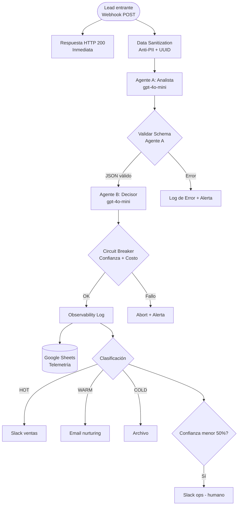

# Arquitectura del Sistema: Lead Qualification Multiagent

## Diagrama de Flujo

```mermaid
flowchart TD
    A([Lead entrante\nWebhook POST]) --> B[Respuesta HTTP 200\nInmediata]
    A --> C[Data Sanitization\nAnti-PII + UUID]
    C --> D[Agente A: Analista\ngpt-4o-mini]
    D --> E{Validar Schema\nAgente A}
    E -->|JSON válido| F[Agente B: Decisor\ngpt-4o-mini]
    E -->|Error| ERR1[Log de Error + Alerta]
    F --> G{Circuit Breaker\nConfianza + Costo}
    G -->|OK| H[Observability Log]
    G -->|Fallo| ERR2[Abort + Alerta]
    H --> I[(Google Sheets\nTelemetría)]
    H --> J{Clasificación}
    J -->|HOT| K[Slack ventas]
    J -->|WARM| L[Email nurturing]
    J -->|COLD| M[Archivo]
    J --> N{Confianza menor 50%?}
    N -->|Sí| O[Slack ops - humano]
```

## Patrón: Handoff (Cadena)

|
