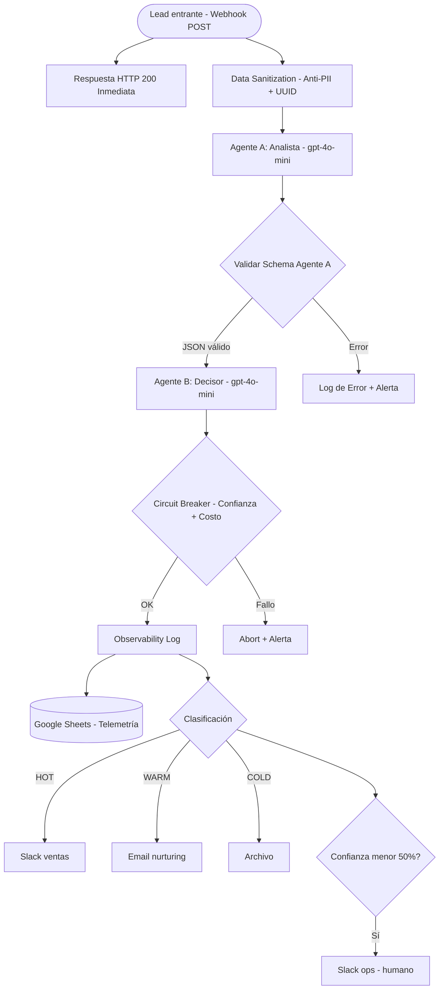

# Arquitectura del Sistema: Lead Qualification Multiagent

## Diagrama de Flujo

## Patrón: Handoff (Cadena)

| Agente | Rol | Output |
|--------|-----|--------|
| Agente A (Analista) | Extrae y valida datos | JSON con score de completitud |
| Agente B (Decisor) | Clasifica y decide acción | Hot/Warm/Cold + acción |

## Capas de Seguridad

- Data Sanitization elimina PII antes de llamar a OpenAI
- Validador de schema entre agentes
- Circuit Breaker: corta si costo mayor $0.50 o confianza menor 50%
- Human-in-the-Loop automático

## Variables de Entorno

Ver `.env.example` en la raíz del repositorio.
